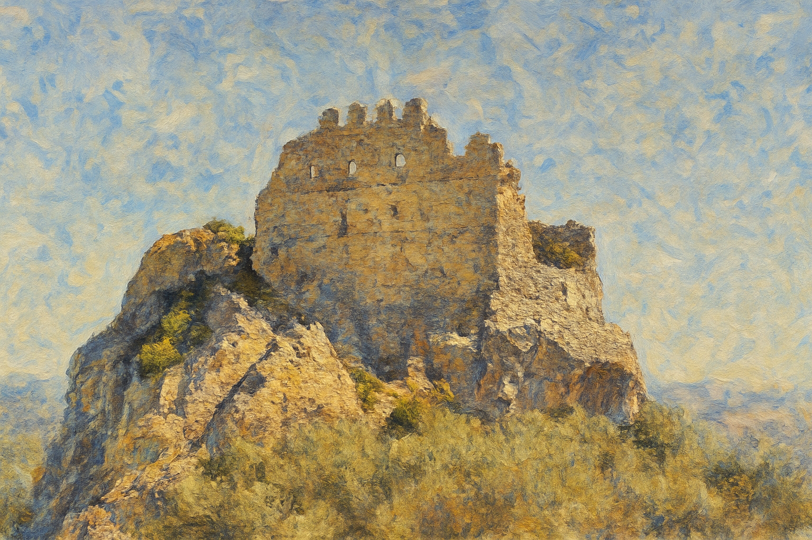
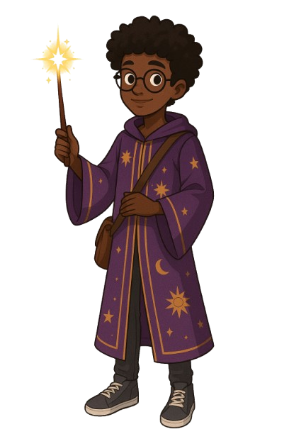
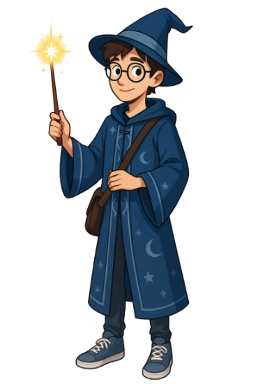
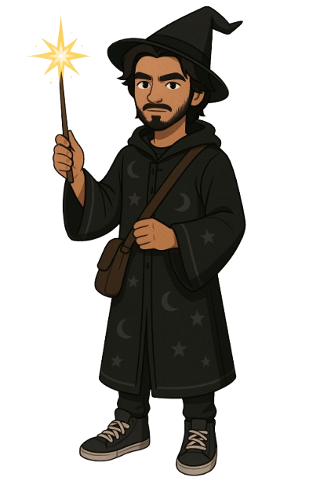

# Bird That Flies High

*Bird That Flies High* é um jogo criado como parte da disciplina **Projeto de Jogos**, ministrada pelo professor **Geraldo Xéxeo**.

A proposta do trabalho pedia que, de alguma maneira, o jogo incorporasse elementos do **Impressionismo** — seja na estética visual, na narrativa ou na atmosfera. Essa diretriz foi fundamental para guiar o estilo artístico e o tom sensível da experiência.

A inspiração para o jogo veio da combinação de um sonho que eu tives e acontecimentos reais da minha vida. Esses elementos se uniram para formar a base do conceito, da estética e da mecânica do jogo. O resultado é uma experiência que mistura emoção, desafio e reflexão de forma leve e envolvente.

O desenvolvimento do projeto foi uma oportunidade de transformar experiências pessoais em uma narrativa interativa, utilizando as ferramentas e conhecimentos adquiridos ao longo do curso.

## Cenários 
*Castelo em Ruínas* é um exemplo de uma obra original do período impressionismo, que incorporamos no projeto. Outros cenários como por exemplo a sala de aula, ou a biblioteca da escola, foram criadas com auxílio de **Inteligência Artficial**, com o prompt pedindo que seguissem o estilo artístico impressionista.

## Personagens

> “Às vezes, as melhores ideias nascem quando estamos dormindo — ou enfrentando a vida acordados.”